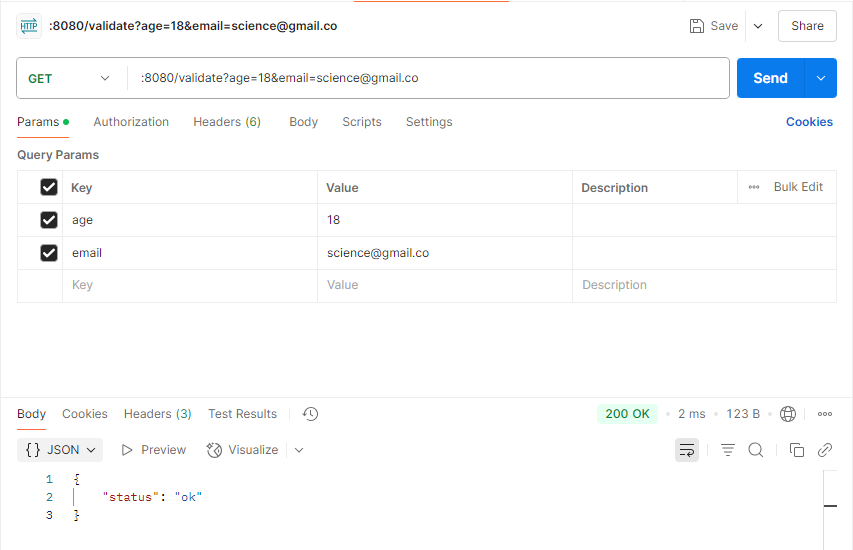

# API Handler Sederhana: Validasi Data

HTTP server sederhana yang menggunakan library bawaan `net/http` dengan endpoint /validate, dimana dia akan menerima query param `email` dan `age` yang kemudian akan divalidasi isi `email` dan `age`. Email tidak boleh kosong dan age harus valid dan lebih dari atau sama dengan 18. Respon yang diharapkan dalam bentuk JSON `{"status": "ok"}` jika berhasil atau `{"error": "message"}` jika ada error.

HTTP server ini juga perlu logging setiap kali ada permintaan yang masuk. Gunakan `http.StatusBadRequest` jika ada kesalahan masukan dari permintaan.

# Menjalankan Program

Ada dua cara menjalankan program. Pertama menjalankan langsung menggunakan "go run"

`go run main.go`

Kedua, mem-build source code menjadi file yang bisa dieksekusi (misalnya \*.exe)

```bash
go build -o build/main main.go  # Build
./build/main                    # Menjalankan
```

## Pengujian Program

Pengujian program bisa dilakukan pada web browser dengan mengaksesnya di laman [http://localhost:8080/validate](http://localhost:8080/validate) lalu ditambahkan query param seperti `email=` dan `age=`. Bisa juga menggunakan postman untuk mempermudah menambahan query param.


Gambar 1: Menguji API menggunakan postman
